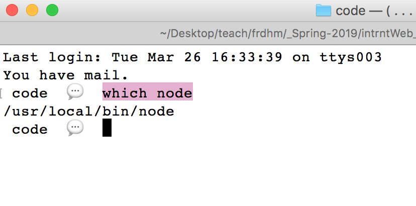

### Week 10
### Intro to Node + Express

[Node.js](https://nodejs.org/en/)(aka Node) is a version of Javascript that works outside the browser. It can run on the command line and on servers.

Node was originally used for writing backend applications without a browser, though it can be used to manage the server in addition to the software you write for a browser ECMAScript engine for builidng server side apps. Uses [V8](https://v8.dev/)

#### Event / Callback driven 
A callback function is registered for a specific event. When that event occurs the callback method is run.

#### Prototyping a Server
In order to run node serves that are accessible via the web, we'll need somewhere to host it. Luckily our Storm servers have node configured. For today, we are going to be using code that will mimick a server so that we can prototype using a local port - in leiu of the python local server ;)


#### Step 1: Installing / Accessing Node
Check to see if you have Node installed. On your command line - in your project folder type:

```
node -v
```
If you have node installed you should see something like this:


wndws: [dwnld node](https://nodejs.org/en/)
mac (if you have [Homebrew](https://brew.sh/) installed): brew install node

like python once installed you can run node by typing "node" into the command line

exit node w: CMMND or CNRTL C

#### Step 2: Initiating Node Packages w/ NPM
npm is the node package manager. It's a common way to install any node package which add to the base functionality.  
[search for packages](https://www.npmjs.com/).
```
Go to yr project directory + type: npm init
To install a package: npm install <module_name> -- save
To install a node package globablly: install -g
```
#### Step 3: Installing Express
[express](https://expressjs.com) is a framework for making HTTP servers w/ node. To install you use npm in the directory that will contain yr project:
 
```
npm install express
```
#### Step 4: Routes
A “route” is how the server responds to a specific request based on the request’s “path”. Here is a basic Express server which responds with “Hello World” when the client requests the path “/”:
```
const theExpress = require('express');
const theApp = theExpress();
const thePort = 12345;

theApp.get('/', function (theRequest, theResponse) {
  theResponse.send('Hello Worlds!!')
})

theApp.listen(thePort, function () {
  console.log('Example app listening on port 12345!')
})
```
[Express Routing Guide](https://expressjs.com/en/guide/routing.html)
#### Step 5: Running the Server
In your terminal:
```
node myServer.js
```
#### Step 5: Other Routes
Of course a route can be for any “path”, here is an example for “/otherData”:
```
theApp.get('/otherData', function (theRequest, theResponse) {
  theResponse.send('Hello Worlds!!')
})
```
